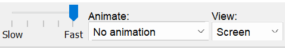
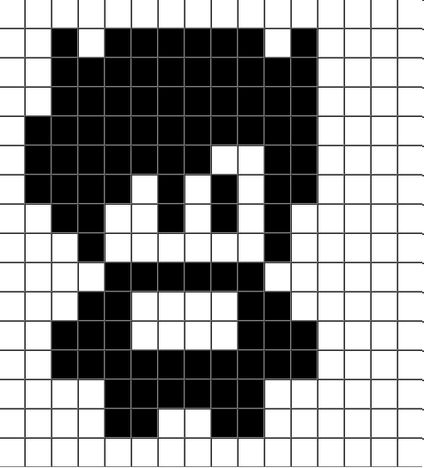
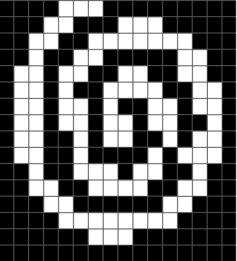
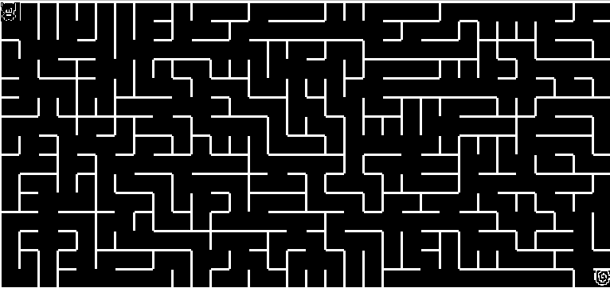

# **Hello World~** 👋🏻
Hi, sorry for my poor English. I'm from Vietnam and English is not my first language.
I was try my best to wrote this document in English, hope you can understand it. Enjoy 🥰!

## **Darkeum**
---

Last night, you just spent a wonderful night with your new wife. Thinking that your life will start to change from here, life will be full of love in a happy little family.

But you suddenly wake up, next to you is not the familiar warmth of your wife, but countless pieces of human bone fragments, looking around and not seeing any familiar images. The small fire from the surrounding torches temporarily illuminates the unfamiliar scene, you realize you are in a dark labyrinth. 

Confusion, panic, fear, that was your feeling at that time, after a long time sinking into despair, you suddenly remembered your wife, friends and even the old stories. 

When you were a child, you also lived in a happy family, your father was a professional explorer, your mother was a teacher, from a young age you were told about your adventures in caves and endless mazes, but you find it extremely boring and never listen to it, the happiest times are when you watch your mother cook delicious food. 

But that happiness did not last long, suddenly one day your father disappeared on an expedition, your mother was extremely worried and rushed to ask for help from his old colleagues to ask for help and because it was too fast. There was an accident that took her mother's life. 

Since then you sink into loneliness, gradually closing yourself. Until meeting your current wife, in contacts, she helped you out of the abyss of despair and gradually you fell in love with her. Whatever happens will come, both of them get married and just got married yesterday.

...

The scene returned to the present, the surrounding was still a labyrinth full of human bones, and only a few flickering torches. You calm down, remembering what your father told him about his adventures and his experiences, your only goal right now is to find a way out of this place as soon as possible.

## **Installation**
---
### **Use the provided `.vm` code**

You can use the `VMEmulator` that provided under the `Nand2Tetris/tools` folder to run the `path/to/Darkeum/` folder.

### **Translate all the `.jack` code by yourself**

Go to the provided `Nand2Tetris/tools` folder and use the `JackCompiler` to compile the `Darkeum/source` folder
```bash
path/to/Nand2Tetris/tools: ~$ JackCompiler /path/to/Darkeum/source
```
After that, some `.vm` files will be generated under that folder.

Then, use the `VMEmulator` that provided under the `Nand2Tetris/tools` folder to run the folder contain all the translated `.vm` file.

## **How to play 🎮**

---

**NOTE ⚡**

Due to the limitations of the HACK computer, sometimes the maze generation of the game will fail, because of the heap overflow.
In this case, you can try to re-run the game again.

Before you start the game, you have to set the settings of VMemulator as follows:

1. **Speed**: The speed of the emulator, the higher the faster. Set it to **Fastest**.
2. **Animate**: The animation of the emulator, set it to **No animation**.
3. **View**: The view of the emulator, set it to **Screen**.

---

### ***Settings***


### ***Character***


### ***End Portal***


### ***Map***


You start from the top left corner of the map, and you must find your way to the **End Portal** at the bottom right corner to escape.

### ***Keyboard controls***
- Press <kbd>↑</kbd> or <kbd>W</kbd> to go up.
- Press <kbd>↓</kbd> or <kbd>S</kbd> to go down.
- Press <kbd>←</kbd> or <kbd>A</kbd> to go left.
- Press <kbd>→</kbd> or <kbd>D</kbd> to go right.
- Press <kbd>Q</kbd> or <kbd>ESC</kbd> to quit.